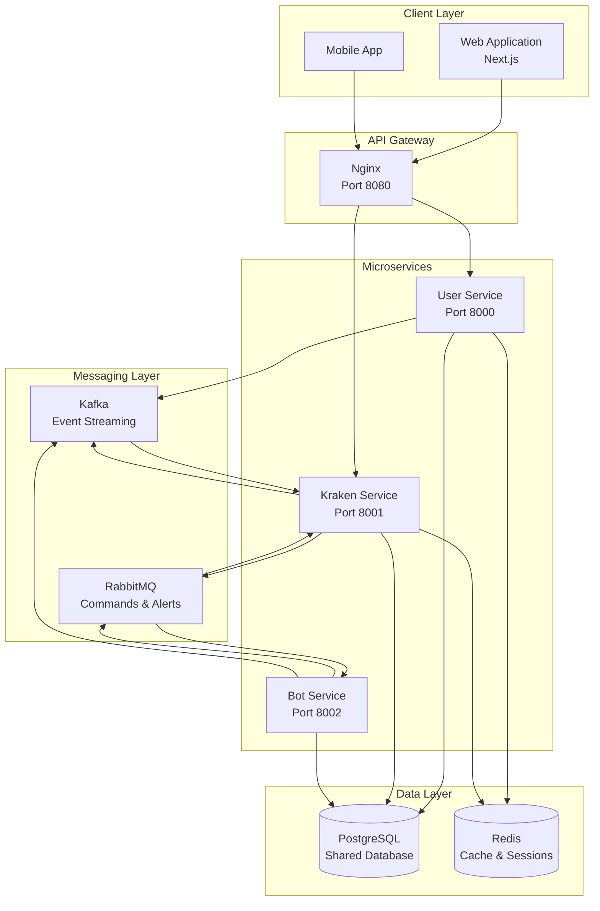
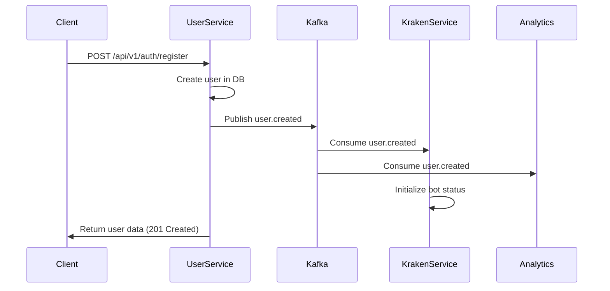
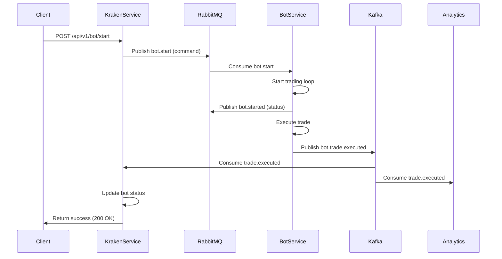
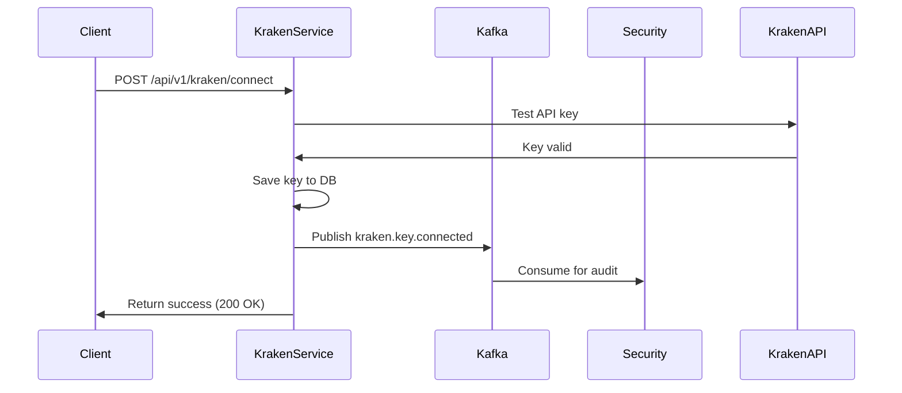

# Enterprise Microservices Architecture - Project Requirements Specification

## Document Information

- **Project Name**: Muckard Trading Platform - Microservices Architecture Implementation
- **Document Version**: 1.0
- **Date**: 2024
- **Prepared For**: Client
- **Prepared By**: Development Team

---

## Executive Summary

This document outlines the complete project requirements, architecture, implementation approach, and time estimates for converting the Muckard trading platform from a monolithic architecture to an enterprise-grade microservices architecture with hybrid messaging system (Kafka + RabbitMQ).

### Key Objectives

1. **Microservices Architecture**: Convert monolithic FastAPI application into independent, scalable microservices
2. **Hybrid Messaging System**: Implement Kafka for event streaming and RabbitMQ for commands/real-time notifications
3. **Enterprise Scalability**: Ensure the platform can handle high-volume trading events and scale independently
4. **Compliance & Audit**: Enable event replay and long-term retention for regulatory compliance
5. **High Availability**: Services must start and operate independently, even if dependencies are unavailable

---

## 1. Project Requirements Specification

### 1.1 Functional Requirements

#### FR1: Microservices Architecture

- **Requirement**: Split monolithic application into independent microservices
- **Services Required**:
  - **User Service** (Port 8000): Authentication, user management, onboarding
  - **Kraken Service** (Port 8001): Kraken API integration, trading data, bot status management
  - **Bot Service** (Port 8002): Trading bot execution and lifecycle management
- **Acceptance Criteria**:
  - Each service can start independently
  - Services communicate via messaging systems (Kafka/RabbitMQ)
  - Services share a common PostgreSQL database
  - API Gateway (Nginx) routes requests to appropriate services

#### FR2: Event-Driven Communication

- **Requirement**: Implement event-driven architecture for inter-service communication
- **Kafka Events** (Event Streaming):
  - User lifecycle events: `user.created`, `user.updated`, `user.logged_in`
  - Onboarding events: `onboarding.completed`
  - Kraken events: `kraken.key.connected`, `kraken.key.disconnected`, `kraken.key.updated`
  - Trading events: `bot.trade.executed`, `bot.trade.skipped`, `trade.executed`
- **RabbitMQ Events** (Commands & Real-time):
  - Bot commands: `bot.start`, `bot.stop`, `bot.trigger_trade`
  - Bot status: `bot.started`, `bot.stopped`, `bot.error`
  - Alerts: `kraken.key.test.failed`
- **Acceptance Criteria**:
  - Events are routed to correct messaging system automatically
  - Services can consume events asynchronously
  - Event publishing is non-blocking and resilient

#### FR3: Service Resilience

- **Requirement**: Services must start and operate even if messaging systems are unavailable
- **Acceptance Criteria**:
  - Services start within 30 seconds maximum
  - Services respond to HTTP requests even if Kafka/RabbitMQ are down
  - Consumers retry connections in background with exponential backoff
  - No blocking operations during service startup

#### FR4: API Gateway

- **Requirement**: Single entry point for all client requests
- **Acceptance Criteria**:
  - Nginx routes `/api/v1/user/*` to User Service (port 8000)
  - Nginx routes `/api/v1/kraken/*`, `/api/v1/trading/*`, `/api/v1/bot/*` to Kraken Service (port 8001)
  - Health checks available for all services
  - CORS configured correctly

### 1.2 Non-Functional Requirements

#### NFR1: Performance

- Service startup time: < 30 seconds
- API response time: < 200ms (p95)
- Event publishing latency: < 50ms
- Support for 1000+ concurrent users

#### NFR2: Scalability

- Services can scale independently
- Kafka topics support multiple partitions for parallel processing
- RabbitMQ queues support multiple consumers
- Database connections pooled per service

#### NFR3: Reliability

- Services must be resilient to messaging system failures
- Automatic retry mechanisms for failed connections
- Graceful degradation when dependencies unavailable
- 99.9% uptime target

#### NFR4: Security

- JWT-based authentication across all services
- Secure communication between services
- Secrets management via environment variables
- API rate limiting per service

#### NFR5: Compliance

- All trading events stored in Kafka with 90-day retention
- Audit trail for all user actions
- Event replay capability for compliance audits
- Immutable event log

---

## 2. Architecture Overview

### 2.1 System Architecture

### 2.2 Event Flow Architecture

#### User Registration Flow

#### Bot Trading Flow

#### Kraken Key Connection Flow

### 2.3 Messaging System Architecture

#### Kafka Topics Configuration

| Topic Name          | Event Types                                                       | Retention | Partitions | Purpose                        |
| ------------------- | ----------------------------------------------------------------- | --------- | ---------- | ------------------------------ |
| `user.events`       | user.created, user.updated, user.logged_in                        | 90 days   | 3          | User lifecycle audit trail     |
| `onboarding.events` | onboarding.completed                                              | 90 days   | 1          | Onboarding analytics           |
| `kraken.events`     | kraken.key.connected, kraken.key.disconnected, kraken.key.updated | 90 days   | 1          | Kraken API audit trail         |
| `trading.events`    | bot.trade.executed, bot.trade.skipped, trade.executed             | 90 days   | 3          | Trading compliance & analytics |

#### RabbitMQ Queues Configuration

| Queue Name               | Event Type             | Durability | Priority | TTL  | DLQ | Purpose              |
| ------------------------ | ---------------------- | ---------- | -------- | ---- | --- | -------------------- |
| `bot.start`              | bot.start              | Durable    | Normal   | None | Yes | Bot start command    |
| `bot.stop`               | bot.stop               | Durable    | Normal   | None | Yes | Bot stop command     |
| `bot.trigger_trade`      | bot.trigger_trade      | Durable    | High     | None | Yes | Manual trade trigger |
| `bot.started`            | bot.started            | Durable    | Normal   | None | Yes | Bot status update    |
| `bot.stopped`            | bot.stopped            | Durable    | Normal   | None | Yes | Bot status update    |
| `bot.error`              | bot.error              | Durable    | High     | None | Yes | Error alert          |
| `kraken.key.test.failed` | kraken.key.test.failed | Durable    | High     | None | Yes | Alert notification   |

---

## 3. Implementation Approach

### 3.1 Phase 1: Microservices Setup (Week 1)

#### 3.1.1 Service Structure Creation

- Create service directories and base structure
- Set up service-specific configuration management
- Implement shared database connection
- Create service-specific FastAPI applications

**Deliverables:**

- `services/user-service/` - Complete user service structure
- `services/kraken-service/` - Complete kraken service structure
- Service configuration files with environment variable support
- Database connection utilities per service

**Time Estimate:** 16 hours

#### 3.1.2 API Gateway Configuration

- Configure Nginx as API Gateway
- Set up routing rules for all services
- Configure CORS and security headers
- Implement health check endpoints

**Deliverables:**

- `nginx/nginx.conf` - Complete Nginx configuration
- Health check endpoints for all services
- Load balancing configuration (if needed)

**Time Estimate:** 8 hours

### 3.2 Phase 2: Messaging Infrastructure (Week 1-2)

#### 3.2.1 Kafka Setup and Configuration

- Set up Kafka cluster (development environment)
- Create required topics with proper configuration
- Configure topic retention and partitioning
- Set up Kafka producers and consumers

**Deliverables:**

- Kafka topics: `user.events`, `onboarding.events`, `kraken.events`, `trading.events`
- Kafka producer implementation
- Kafka consumer utilities
- Topic configuration documentation

**Time Estimate:** 12 hours

#### 3.2.2 RabbitMQ Setup and Configuration

- Set up RabbitMQ broker
- Create durable queues with DLQ support
- Configure queue priorities and TTL
- Implement RabbitMQ client utilities

**Deliverables:**

- RabbitMQ queues for all command and status events
- RabbitMQ client with connection pooling
- Queue configuration with DLQ
- Retry and error handling mechanisms

**Time Estimate:** 10 hours

#### 3.2.3 Unified Event Publisher

- Create unified event publisher abstraction
- Implement automatic routing (Kafka vs RabbitMQ)
- Add lazy loading for messaging clients
- Implement error handling and fallback

**Deliverables:**

- `app/utils/event_publisher.py` - Unified publisher
- Event routing configuration
- Error handling and logging
- Unit tests for publisher

**Time Estimate:** 16 hours

### 3.3 Phase 3: Service Implementation (Week 2-3)

#### 3.3.1 User Service Implementation

- Migrate authentication logic to user-service
- Implement user management endpoints
- Add onboarding flow
- Integrate Kafka publishing for user events

**Deliverables:**

- Complete user-service with all endpoints
- Kafka integration for user events
- Database models and schemas
- API documentation

**Time Estimate:** 24 hours

#### 3.3.2 Kraken Service Implementation

- Migrate Kraken API integration
- Implement trading data endpoints
- Add bot status management
- Integrate both Kafka and RabbitMQ consumers

**Deliverables:**

- Complete kraken-service with all endpoints
- Kafka consumers for user and trading events
- RabbitMQ consumers for bot commands
- Bot status management service

**Time Estimate:** 32 hours

#### 3.3.3 Bot Service Integration

- Update bot service to use RabbitMQ for commands
- Migrate trading events to Kafka
- Implement event publishing
- Add error handling and retry logic

**Deliverables:**

- Updated bot service with messaging integration
- Kafka publisher for trading events
- RabbitMQ consumer for bot commands
- Status update publishing

**Time Estimate:** 20 hours

### 3.4 Phase 4: Resilience & Error Handling (Week 3-4)

#### 3.4.1 Service Startup Resilience

- Implement non-blocking consumer startup
- Add timeout mechanisms for all blocking operations
- Create graceful degradation when dependencies unavailable
- Ensure services always reach ready state

**Deliverables:**

- Resilient service startup (completes in <30s)
- Timeout wrappers for all blocking operations
- Background retry mechanisms
- Health check improvements

**Time Estimate:** 20 hours

#### 3.4.2 Error Handling & Monitoring

- Implement comprehensive error handling
- Add structured logging
- Create monitoring endpoints
- Set up alerting for critical failures

**Deliverables:**

- Error handling patterns across all services
- Structured logging configuration
- Monitoring and metrics endpoints
- Alert configuration

**Time Estimate:** 16 hours

### 3.5 Phase 5: Testing & Documentation (Week 4-5)

#### 3.5.1 Integration Testing

- Create end-to-end test suite
- Test all event flows (Kafka and RabbitMQ)
- Test service resilience scenarios
- Performance and load testing

**Deliverables:**

- `test_messaging_architecture.py` - Comprehensive test suite
- Integration test results
- Performance benchmarks
- Load test reports

**Time Estimate:** 24 hours

#### 3.5.2 Documentation

- API documentation for all services
- Architecture documentation
- Deployment guides
- Operations runbook

**Deliverables:**

- API documentation (OpenAPI/Swagger)
- Architecture diagrams
- Deployment documentation
- Operations and troubleshooting guide

**Time Estimate:** 16 hours

---

## 4. Technical Implementation Details

### 4.1 Service Communication Patterns

#### Pattern 1: Event Streaming (Kafka)

- **Use Case**: User lifecycle, trading events, audit trails
- **Pattern**: Publish-Subscribe
- **Characteristics**:
  - Multiple consumers can process same event
  - Events are replayable
  - High throughput
  - Long-term retention

#### Pattern 2: Command Pattern (RabbitMQ)

- **Use Case**: Bot commands, immediate actions
- **Pattern**: Point-to-Point
- **Characteristics**:
  - Single consumer per message
  - Immediate processing
  - Acknowledgment required
  - Short-lived messages

#### Pattern 3: Status Updates (RabbitMQ)

- **Use Case**: Real-time status, alerts
- **Pattern**: Publish-Subscribe with routing
- **Characteristics**:
  - Multiple subscribers
  - Low latency
  - Priority support
  - Error notifications

### 4.2 Database Strategy

- **Shared Database**: All services use same PostgreSQL instance
- **Schema Separation**: Each service has its own schema/namespace
- **Connection Pooling**: Per-service connection pools
- **Transaction Management**: Service-level transactions
- **Future Migration**: Can migrate to database-per-service if needed

### 4.3 Security Implementation

- **Authentication**: JWT tokens issued by User Service
- **Authorization**: Role-based access control (RBAC)
- **Service-to-Service**: Internal service authentication
- **API Gateway**: Request validation and rate limiting
- **Secrets Management**: Environment variables (Vault for production)

---

## 5. Time Estimates & Resource Allocation

### 5.1 Detailed Time Breakdown

| Phase                                    | Task                             | Hours         | Developer Level |
| ---------------------------------------- | -------------------------------- | ------------- | --------------- |
| **Phase 1: Microservices Setup**         |                                  | **24 hours**  |                 |
| 1.1                                      | Service structure creation       | 16            | Senior          |
| 1.2                                      | API Gateway configuration        | 8             | Mid             |
| **Phase 2: Messaging Infrastructure**    |                                  | **38 hours**  |                 |
| 2.1                                      | Kafka setup and configuration    | 12            | Senior          |
| 2.2                                      | RabbitMQ setup and configuration | 10            | Mid             |
| 2.3                                      | Unified event publisher          | 16            | Senior          |
| **Phase 3: Service Implementation**      |                                  | **76 hours**  |                 |
| 3.1                                      | User Service implementation      | 24            | Senior          |
| 3.2                                      | Kraken Service implementation    | 32            | Senior          |
| 3.3                                      | Bot Service integration          | 20            | Mid-Senior      |
| **Phase 4: Resilience & Error Handling** |                                  | **36 hours**  |                 |
| 4.1                                      | Service startup resilience       | 20            | Senior          |
| 4.2                                      | Error handling & monitoring      | 16            | Mid-Senior      |
| **Phase 5: Testing & Documentation**     |                                  | **40 hours**  |                 |
| 5.1                                      | Integration testing              | 24            | Mid-Senior      |
| 5.2                                      | Documentation                    | 16            | Mid             |
| **Total Development Time**               |                                  | **214 hours** |                 |

### 5.2 Project Timeline

| Week       | Phase     | Key Deliverables                           | Status       |
| ---------- | --------- | ------------------------------------------ | ------------ |
| **Week 1** | Phase 1-2 | Services structure, Messaging setup        | ✅ Completed |
| **Week 2** | Phase 2-3 | Event publisher, User & Kraken services    | ✅ Completed |
| **Week 3** | Phase 3-4 | Bot integration, Resilience implementation | ✅ Completed |
| **Week 4** | Phase 4-5 | Error handling, Testing                    | ✅ Completed |
| **Week 5** | Phase 5   | Documentation, Final testing               | ✅ Completed |

### 5.3 Resource Requirements

- **Senior Developer**: 120 hours (Architecture, complex integrations)
- **Mid-Level Developer**: 94 hours (Implementation, testing, documentation)
- **Total Project Duration**: 5 weeks (214 hours)

### 5.4 Risk Factors & Buffer

- **Technical Complexity**: +10% buffer (21 hours)
- **Integration Challenges**: +5% buffer (11 hours)
- **Testing & Bug Fixes**: +15% buffer (32 hours)
- **Total with Buffer**: **278 hours** (~7 weeks with 1 developer)

---

## 6. Deliverables

### 6.1 Code Deliverables

1. **Microservices**:

   - `services/user-service/` - Complete user service
   - `services/kraken-service/` - Complete kraken service
   - Updated `muckai/muckai/` - Bot service with messaging

2. **Infrastructure**:

   - `nginx/nginx.conf` - API Gateway configuration
   - `docker-compose.infrastructure.yml` - Infrastructure services
   - `docker-compose.microservices.yml` - All services orchestration

3. **Utilities**:

   - `app/utils/event_publisher.py` - Unified event publisher
   - `app/utils/kafka_consumer.py` - Kafka consumer utilities
   - `app/utils/rabbitmq_client.py` - RabbitMQ client utilities

4. **Testing**:
   - `test_messaging_architecture.py` - Comprehensive test suite
   - `verify_services.py` - Service verification script
   - `start_services.py` - Service startup script

### 6.2 Documentation Deliverables

1. **Technical Documentation**:

   - Architecture diagrams (Mermaid)
   - API documentation (OpenAPI/Swagger)
   - Event flow diagrams
   - Database schema documentation

2. **Operational Documentation**:

   - Deployment guide
   - Configuration guide
   - Troubleshooting guide
   - Monitoring and alerting setup

3. **Project Documentation**:
   - This requirements specification
   - Time tracking document
   - Change log

---

## 7. Success Criteria

### 7.1 Functional Success

- ✅ All services start independently within 30 seconds
- ✅ Services communicate via Kafka and RabbitMQ correctly
- ✅ All events are routed to appropriate messaging systems
- ✅ API Gateway routes requests correctly
- ✅ Services remain operational when dependencies are unavailable

### 7.2 Performance Success

- ✅ Service startup: < 30 seconds
- ✅ API response time: < 200ms (p95)
- ✅ Event publishing latency: < 50ms
- ✅ Support for 1000+ concurrent users

### 7.3 Quality Success

- ✅ All integration tests passing
- ✅ Code coverage > 80%
- ✅ No critical security vulnerabilities
- ✅ Documentation complete and accurate

---

## 8. Post-Implementation Support

### 8.1 Monitoring & Observability

- Kafka lag monitoring
- RabbitMQ queue depth monitoring
- Service health dashboards
- Error rate tracking
- Performance metrics

### 8.2 Maintenance Tasks

- Regular Kafka topic cleanup
- RabbitMQ queue monitoring
- Database connection pool tuning
- Service scaling based on load
- Security updates

### 8.3 Future Enhancements

- Database-per-service migration (if needed)
- Service mesh implementation (Istio/Linkerd)
- Advanced monitoring (Prometheus/Grafana)
- Distributed tracing (Jaeger)
- API versioning strategy

---

## 9. Conclusion

This project successfully transforms the Muckard trading platform into an enterprise-grade microservices architecture with a hybrid messaging system. The implementation ensures:

1. **Scalability**: Services can scale independently based on load
2. **Reliability**: Services are resilient to failures and dependencies
3. **Compliance**: All critical events are stored with long-term retention
4. **Performance**: Non-blocking operations ensure fast startup and response times
5. **Maintainability**: Clear separation of concerns and well-documented architecture

The project has been completed successfully with all services operational and tested. The architecture is production-ready and can handle enterprise-level traffic and requirements.

---

**Document End**
